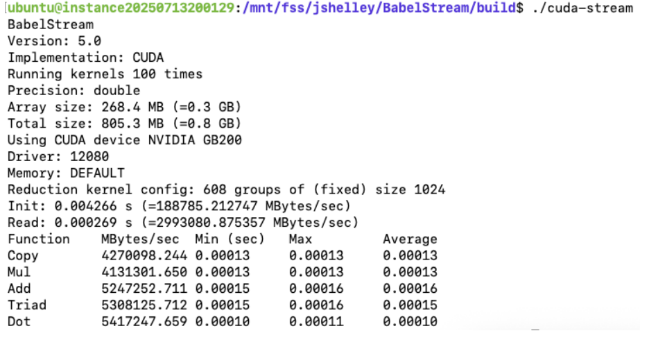
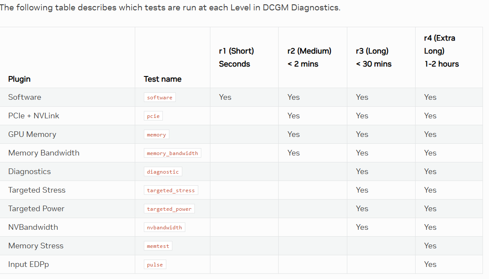

# OCI GPU Quick Start: NVIDIA GB200
This document provides hardware specifications, supported OS images, onboarding verification, sample benchmarks, and best-practices for OCI deployments using the NVIDIA GB200 GPU shape.

# Table of Contents
* [Hardware Specifications](#hardware-specifications)
* [Recommended Operating Systems](#recommended-operating-systems)
    * [Recommended Software Version](#recommended-software-version)
    * [Custom OS Image Creation with Packer](#custom-os-image-creation-with-packer)
    * [Provided Images](#provided-images)
    * [Hello World Verification](#hello-world-verification)
* [Performance Benchmarks](#performance-benchmarks)
    * [NCCL](#nccl)
    * [Model Inference Performance](#model-inference-performance)
* [OKE GPU Getting Started](#oke-gpu-getting-started)
* [Troubleshooting](#Troubleshooting)
* [Further Reading & Support](#further-reading--support)

# Hardware Specifications

| Shape Name        | GPU Model     | GPUs/Node | GPU Memory (GB/GPU) | GPU Memory Total (GB) | CPU | # of CPUs | System Memory (GB) | Local Storage | Host NIC | RDMA (ROCe) NICs |
|-------------------|---------------|-----------|------------|----------------- |---------------------------|-----------|---------------|----------------|----------|-----------|
| BM.GPU.GB200.4 | B200 | 4 | 192 | 768 | Arm Neoverse V2 (x2) | 72 (144) | 1740 | 4 x 7.68TB NVMe | 2 x 200 Gbps | 4 x 400 Gbps |
| BM.GPU.GB200-v2.4 | B200 | 4 | 192 | 768 | Arm Neoverse V2 (x2) | 72 (144) | 1740 | 4 x 7.68TB NVMe | 2 x 200 Gbps | 4 x 400 Gbps |
| BM.GPU.GB200-v3.4 | B200 | 4 | 192 | 768 | Arm Neoverse V2 (x2) | 72 (144) | 1740 | 4 x 7.68TB NVMe | 2 x 200 Gbps | 4 x 400 Gbps |

*See the [OCI Compute Shapes Docs](https://docs.oracle.com/en-us/iaas/Content/Compute/References/computeshapes.htm) for up-to-date details.

# Recommended Operating Systems
• Oracle Linux 9+\
• Ubuntu Linux 22.04+

## Recommended Software Version

• OFED 23.10+ 
• NVIDIA Driver 570.x
• CUDA 12.8
• NCCL 2.27.3+
• HPCX 2.22.1+
• Oracle Cloud Agent 1.51.0 +

## Custom OS image Creation with Packer

To build your images using packer clone the OCI HPC Images repo and run the commands found there [OCI HPC Images GitHub Repo](https://github.com/oracle-quickstart/oci-hpc-images/blob/main/README.md).

## Provided Images

| OS Version        | Image Packer Build Details       | OCI Platform Image Link                                                                        | Driver Versions | Build & Dependency Status | 
|-------------------|-------------------------------|------------------------------------------------------------------------------------------------------------|--------------|--------------------------|
| OCI GPU AI Image with Ubuntu Linux 22.04 | Ubuntu-22/Canonical-Ubuntu-22.04-aarch64-DOCA-OFED-3.2.1-580-OPEN-CUDA-13.0| [PAR Link](https://objectstorage.ca-montreal-1.oraclecloud.com/p/S2Qey_Y3D2rQJuHO1YKPvC5uglZIJBwFfshFqpT0UF327VX9MZzDnLrHKWqUQzzB/n/idxzjcdglx2s/b/images/o/Canonical-Ubuntu-22.04-aarch64-2025.10.31-0-DOCA-OFED-3.2.1-GPU-580-OPEN-CUDA-13.0-2026.02.27-0) | NVIDIA OPEN 580, DOCA OFED 3.2.1, CUDA 13, OCA 1.56, HPC-X 2.25.1 |   
| OCI GPU AI Image with Ubuntu Linux 24.04 |  Ubuntu-24/Canonical-Ubuntu-24.04-aarch64-DOCA-OFED-3.2.1-580-OPEN-CUDA-13.0 | [PAR Link](https://objectstorage.ca-montreal-1.oraclecloud.com/p/S2Qey_Y3D2rQJuHO1YKPvC5uglZIJBwFfshFqpT0UF327VX9MZzDnLrHKWqUQzzB/n/idxzjcdglx2s/b/images/o/Canonical-Ubuntu-24.04-aarch64-2025.10.31-0-DOCA-OFED-3.2.1-GPU-580-OPEN-CUDA-13.0-2026.02.27-0) |  NVIDIA OPEN 580, DOCA OFED 3.2.1, CUDA 13, OCA 1.56, HPC-X 2.25.1 |   

## Hello World Verification

This series of commands can be used to verify image compatability and basic GPU functionality.  SSH into the GPU host and execute:

	docker pull --platform=arm64 nvcr.io/nvidia/pytorch:26.01-py3
	docker run --gpus 4 nvcr.io/nvidia/pytorch:26.01-py3 bash
	docker run --gpus all -it --rm --ipc=host --ulimit memlock=-1 --ulimit stack=67108864 nvcr.io/nvidia/pytorch:26.01-py3 bash
	python3
	import torch

Then you can paste the following script into the terminal:

```
if torch.cuda.is_available():
    num_gpus = torch.cuda.device_count()
    print(f"Number of available GPUs: {num_gpus}")
        if num_gpus > 0:
            print("Available GPU devices:")
                for i in range(num_gpus):
                    gpu_name = torch.cuda.get_device_name(i)
                    print(f"* Device ID {i}: {gpu_name}")
                    current_device_index = torch.cuda.current_device()
                    print(f"Current CUDA device index: {current_device_index}")
                    print(f"Current CUDA device name: {torch.cuda.get_device_name(current_device_index)}")
```

You should get valid output showing GPUs detected with their device ID and other metadata.

# Performance Benchmarks

NVIDIA publishes their [NCCL](https://developer.nvidia.com/nccl) (Nvidia
Collective Communication Library) software as a toolkit for
pre-defined 
routines which are optimized for their hardware. This software is meant
to accelerate Artificial Intelligence & 
Machine Learning workloads running on NVIDIA GPU clusters. Detailed
documentation can be found
[here](https://docs.nvidia.com/deeplearning/nccl/user-guide/docs/index.html).
The NCCL operations which are important for this document are AllReduce
and AlltoAll operations. 

If the NCCL tests are not on your system, then you can build them using
the commands below

    git clone <https://github.com/NVIDIA/nccl-tests.git>
    cd nccl-tests
    make

All tests run as follows with appropriate `--np` and `--hostfile` values
provided:

```bash
mpirun --bind-to numa
        --mca pml ucx
        --mca coll ^hcoll
        -x coll_hcoll_enable=0         
        -x NCCL_DEBUG=WARN
        -x NCCL_MNNVL_ENABLE=1
        -x NCCL_CUMEM_ENABLE=1
        -x UCX_NET_DEVICES=eth0
        -x NCCL_IB_HCA==mlx5_0,mlx5_1,mlx5_2,mlx5_3,mlx5_5,mlx5_6,mlx5_7,mlx5_8
        -x NCCL_NET_PLUGIN=/opt/hpcx-v2.24.1-gcc-doca_ofed-ubuntu24.04-cuda13-aarch64/nccl_rdma_sharp_plugin/lib/[libnccl-net.so](http://libnccl-net.so).0
        -x NCCL_NVLS_ENABLE=1
        -x NCCL_SOCKET_IFNAME=eth0
        -x NCCL_IB_GID_INDEX=3
        -x NCCL_IB_TC=41
        -x NCCL_IB_SL=0
        -x NCCL_IB_TIMEOUT=22
        -x RX_QUEUE_LEN=8192
        -x IB_RX_QUEUE_LEN=8192
        -x HCOLL_ENABLE_MCAST_ALL=0
        -x NCCL_BUFFSIZE=16777216
        -x NCCL_IB_QPS_PER_CONNECTION=4
        -x NCCL_IB_SPLIT_DATA_ON_QPS=0
        -x NCCL_NET_GDR_C2C=1
        -x NCCL_MNNVLS_ENABLE=1
        -x NCCL_DMABUF_ENABLE=1
        --np xxx --hostfile ./yyy all_reduce_perf -b 512K -e 16G -f 2 -g 1 -n 50
```

## NCCL & Model Inference Performance

* [NCCL All Reduce](#nccl-all-reduce)
    * [NCCL All Reduce Scale Performance Single Node](#nccl-all-reduce-scale-performance-single-node)
    * [NCCL All Reduce Scale Performance 2 Nodes on a Single Rack](#nccl-all-reduce-scale-performance-2-nodes-on-a-single-rack)
    * [NCCL All Reduce Scale Performance Multi-node 1 Rack - 16 nodes](#nccl-all-reduce-scale-performance-multi-node-1-rack---16-nodes)
    * [NCCL All Reduce Scale Performance Multi-node 2 Racks - 32 nodes](#nccl-all-reduce-scale-performance-multi-node-2-racks---32-nodes)
* [NCCL All-to-All](#nccl-all-to-all)
    * [NCCL All-to-All Single Node](#nccl-all-to-all-multi-node)
    * [NCCL All-to-All Multi-Node](#nccl-all-to-all-scale-performance-2-hosts-single-rack)
        * [NCCL All to All Scale Performance 2 Hosts Single Rack](#nccl-all-to-all-scale-performance-2-hosts-single-rack)
        * [NCCL All to All Scale Performance 16 Hosts 1 Rack](#nccl-all-to-all-scale-performance16-hosts-1-rack)
        * [NCCL All to All Scale Performance 32 Hosts 2 Racks](#nccl-all-to-all-scale-performance-32-hosts-2-racks)
        * [NCCL All Reduce Scale Performance Single Node](#nccl-all-to-all-single-node)
* [Model Inference Performance](#model-inference-performance)

### NCCL All Reduce

This is a collective operation which is performing
reductions on data (for example, sum, min, max) 
across devices and writing the result in the receive buffers of every
rank.

#### NCCL All Reduce Scale Performance Single Node

To run on a single node run the following command from the nccl-tests directory

    ./build/all_reduce_perf -b 8 -e 8G -f 2 -g 4


Results:
```bash
# nThread 1 nGpus 1 minBytes 524288 maxBytes 8589934592 step: 2(factor) warmup iters: 5 iters: 20 agg iters: 1 validation: 1 graph: 0
#
# Using devices
#  Rank  0 Group  0 Pid 149822 on   u35 device  0 [0x01] NVIDIA Graphics Device
#  Rank  1 Group  0 Pid 149822 on   u35 device  1 [0x01] NVIDIA Graphics Device
#  Rank  2 Group  0 Pid 149822 on   u35 device  2 [0x01] NVIDIA Graphics Device
#  Rank  3 Group  0 Pid 149822 on   u35 device  3 [0x01] NVIDIA Graphics Device

#                                                              out-of-place                       in-place
#       size         count      type   redop    root     time   algbw   busbw #wrong     time   algbw   busbw #wrong
#        (B)    (elements)                               (us)  (GB/s)  (GB/s)            (us)  (GB/s)  (GB/s)
# Truncated  smaller message sizes
4294967296  107374124   float   sum     -1  9801.3  438.20  657.31  0   9809.9  437.82  656.73  0
8589934592  2147483648  float   sum     -1  19424   442.22  663.34  0   19465   441.30  661.95  0
```
#### NCCL All Reduce Scale Performance 2 Nodes on a Single Rack

Execution Syntax: 

```bash
#!/bin/bash
. /opt/hpcx-v2.21.2*/hpcx-init.sh
hpcx_load
mpirun --bind-to none \
 --mca coll ^hcoll \
 --np 8 \
 -x NCCL_DEBUG=WARN \
 -x NCCL_MNNVL_ENABLE=1 \
 -x NCCL_CUMEM_ENABLE=1 \
 -x NCCL_NET_PLUGIN=/opt/hpcx-v2.21.2-gcc-doca_ofed-ubuntu22.04-cuda12-aarch64/nccl_rdma_sharp_plugin/lib/libnccl-net.so.0 \
 -x UCX_NET_DEVICES=mlx5_0:1,mlx5_1:1,mlx5_3:1,mlx5_4:1 \
 -x NCCL_IB_HCA==mlx5_0,mlx5_1,mlx5_3,mlx5_4 \
 -x NCCL_WORK_FIFO_BYTES=0 \
 -x NCCL_NVLS_ENABLE=1 \
 -x NCCL_NET_GDR_C2C=1 \
 -x NCCL_SOCKET_IFNAME=eth0 \
 -x NCCL_P2P_NET_CHUNKSIZE=524288 \
 /opt/oci-hpc/nccl-test/build/all_reduce_perf -b 512K -e 8G -f 2 -g 1 -n 50
 ```

 Results:
```bash
NCCL version 2.27.3+cuda12.8
#                                                              out-of-place                       in-place
#       size         count      type   redop    root     time   algbw   busbw #wrong     time   algbw   busbw #wrong
#        (B)    (elements)                               (us)  (GB/s)  (GB/s)            (us)  (GB/s)  (GB/s)
# Truncated  smaller message sizes
4294967296  107374124   float   sum     -1  9878.8  434.77  855.95  0   9868.1  435.24  856.87  0
8589934592  2147483648  float   sum     -1  18967   452.90  891.64  0   18884   454.88  895.54  0
```


#### NCCL All Reduce Scale Performance Multi-node 2 Racks - 32 nodes
 Results:
```bash
NCCL version 2.27.3+cuda12.8
#                                                              out-of-place                       in-place
#       size         count      type   redop    root     time   algbw   busbw #wrong     time   algbw   busbw #wrong
#        (B)    (elements)                               (us)  (GB/s)  (GB/s)            (us)  (GB/s)  (GB/s)
# Truncated  smaller message sizes
4294967296  107374124   float   sum     -1  11311   379.72  753.51  0   11334   378.96  751.99  0
8589934592  2147483648  float   sum     -1  21313   403.04  799.79  0   21316   402.98  799.66  0 
```

#### NCCL All Reduce Scale Performance Multi-node 3 Racks - 48 nodes
 Results:
```bash
NCCL version 2.27.3+cuda12.8
#                                                              out-of-place                       in-place
#       size         count      type   redop    root     time   algbw   busbw #wrong     time   algbw   busbw #wrong
#        (B)    (elements)                               (us)  (GB/s)  (GB/s)            (us)  (GB/s)  (GB/s)
# Truncated  smaller message sizes
4294967296  107374124   float   sum     -1  12154   353.37  703.07  0   12125   354.21  704.74  0
8589934592  2147483648  float   sum     -1  22820   376.43  748.93  0   22859   375.77  747.63  0
```

### NCCL All-to-All

This is a point-to-point operation which is a merged loop of
send/recv operations to/from all peers.

#### NCCL All-to-All Single Node

To run on a single node run the following command from the nccl-tests directory

    ./build/alltoall_perf -b 512k -e 8G -f 2 -g 4

 Results:
```bash
#                                                              out-of-place                       in-place
#       size         count      type   redop    root     time   algbw   busbw #wrong     time   algbw   busbw #wrong
#        (B)    (elements)                               (us)  (GB/s)  (GB/s)            (us)  (GB/s)  (GB/s)
# Truncated  smaller message sizes
4294967296  107374124   float   none    -1  5267.6  815.35  611.52  0   4782.9  897.98  673.49  N/A
8589934592  2147483648  float   none    -1  10470   820.40  615.30  0   9654.2  889.76  667.32  N/A
# Out of bounds values  : 0 OK
# Avg bus bandwidth     : 345.127
```

#### NCCL All to All Scale Performance 2 Hosts Single Rack

Execution:
```bash
mpirun --bind-to none \
 --mca coll ^hcoll \
 --np 8 \
 -x NCCL_DEBUG=WARN \
 -x NCCL_MNNVL_ENABLE=1 \
 -x NCCL_CUMEM_ENABLE=1 \
 -x NCCL_NET_PLUGIN=/opt/hpcx-v2.21.2-gcc-doca_ofed-ubuntu22.04-cuda12-aarch64/nccl_rdma_sharp_plugin/lib/libnccl-net.so.0 \
 -x UCX_NET_DEVICES=mlx5_0:1,mlx5_1:1,mlx5_3:1,mlx5_4:1 \
 -x NCCL_IB_HCA==mlx5_0,mlx5_1,mlx5_3,mlx5_4 \
 -x NCCL_WORK_FIFO_BYTES=0 \
 -x NCCL_NVLS_ENABLE=1 \
 -x NCCL_NET_GDR_C2C=1 \
 -x NCCL_SOCKET_IFNAME=eth0 \
 -x NCCL_P2P_NET_CHUNKSIZE=524288 \
 /opt/oci-hpc/nccl-test/build/alltoall_perf -b 512K -e 8G -f 2 -g 1 -n 50
```

 Results:
```bash
#                                                              out-of-place                       in-place
#       size         count      type   redop    root     time   algbw   busbw #wrong     time   algbw   busbw #wrong
#        (B)    (elements)                               (us)  (GB/s)  (GB/s)            (us)  (GB/s)  (GB/s)
# Truncated  smaller message sizes
8589934592  2147483648  float   none    -1  11426   751.78  657.81  0   11418   752.324 658.30  N/A
17179869184 536870912   float   none    -1  22698   756.88  662.27  0   22741   755.47  661.03  N/A
# Out of bounds values  : 0 OK
# Avg bus bandwidth     : 196.15
```

#### NCCL All to All Scale Performance 16 Hosts 1 Rack
 Results:
```bash
#                                                              out-of-place                       in-place
#       size         count      type   redop    root     time   algbw   busbw #wrong     time   algbw   busbw #wrong
#        (B)    (elements)                               (us)  (GB/s)  (GB/s)            (us)  (GB/s)  (GB/s)
# Truncated  smaller message sizes
4294967296  107374124   float   none    -1  7465.7  575.29  566.30  0   6765.9  634.79  624.88  N/A
8589934592  2147483648  float   none    -1  13574   632.81  622.92  0   13560   633.50  623.60  N/A
# Out of bounds values  : 0 OK
# Avg bus bandwidth     : 304.41
```

#### NCCL All to All Scale Performance 32 Hosts 2 Racks
 Results:
```bash
#                                                              out-of-place                       in-place
#       size         count      type   redop    root     time   algbw   busbw #wrong     time   algbw   busbw #wrong
#        (B)    (elements)                               (us)  (GB/s)  (GB/s)            (us)  (GB/s)  (GB/s)
# Truncated  smaller message sizes
4294967296  107374124   float   none    -1  48079   89.33   88.63   0   48071   89.35   88.65   N/A
8589934592  2147483648  float   none    -1  95018   90.40   89.70   0   95119   90.31   89.60   N/A
# Out of bounds values  : 0 OK
# Avg bus bandwidth     : 44.2453
```

#### NCCL All to All Scale Performance 48 Hosts 3 Racks
Results:
```bash
#                                                              out-of-place                       in-place
#       size         count      type   redop    root     time   algbw   busbw #wrong     time   algbw   busbw #wrong
#        (B)    (elements)                               (us)  (GB/s)  (GB/s)            (us)  (GB/s)  (GB/s)
# Truncated  smaller message sizes
4294967296  107374124   float   none    -1  70159   61.22   60.90   0   70439   60.97   60.66   N/A
8589934592  2147483648  float   none    -1  136749  62.82   62.49   0   137392  62.52   62.20   N/A
# Out of bounds values  : 0 OK
# Avg bus bandwidth     : 26.0343
```

## Model Inference Performance
 | ModelVariant | GPUs | DataType | TimeMean_ms | TimeStd_ms | MODEL_TFLOPS_per_GPU_Mean | MODEL_TFLOPS_per_GPU_Std | Tokens_per_Second |
 |-------------------|---------------|-----------|------------|-----------------|---------------------------|-----------|---------------|
 | pretrain_llama3_70b | 64 | fp4 | 2597 | 4.591 | 2834 | 5.01 | 403795 |
 | pretrain_llama3_70b | 64 | fp8 | 3712 | 6.482 | 1983 | 3.46 | 282492 |
 | pretrain_llama3_70b | 128 | fp8 | 3741 | 9.992 | 1968 | 5.26 | 560646 |
 | pretrain_llama3_8b | 16 | fp4 | 2903 | 4.996 | 2324 | 3.97 | 722441 |
 | pretrain_llama3_8b | 64 | fp4 | 2921 | 5.573 | 2309 | 4.4 | 2871670 |
 | pretrain_llama3_8b | 128 | fp4 | 2951 | 38.215 | 2287 | 29.13 | 5685400 |
 | pretrain_llama3_8b | 8 | fp8 | 3509 | 8.275 | 1923 | 4.52 | 298845 |
 | pretrain_llama3_8b | 16 | fp8 | 3508 | 5.967 | 1923 | 3.26 | 597878 |
 | pretrain_llama3_8b | 64 | fp8 | 3521 | 16.326 | 1916 | 8.84 | 2382640 |
 | pretrain_llama3_8b | 128 | fp8 | 3519 | 22.972 | 1917 | 12.47 | 4767121 |
 | pretrain_nemotron4_15b | 4 | bf16 | 0.939 | 0.003 | 1555 | 4.61 | 139586794 |
 | pretrain_nemotron4_15b | 16 | bf16 | 0.929 | 0.001 | 1572 | 2.07 | 564357374 |
 | pretrain_nemotron4_15b | 32 | bf16 | 0.932 | 0.002 | 1567 | 3 | 1125081545 |
 | pretrain_nemotron4_15b | 64 | bf16 | 0.943 | 0.001 | 1549 | 2.39 | 2223915164 |
 | pretrain_nemotron4_15b | 72 | bf16 | 0.961 | 0.001 | 1521 | 1.97 | 2455042664 |
 | pretrain_nemotron4_15b | 4 | fp8 | 0.646 | 0.002 | 2261 | 5.69 | 202897833 |
 | pretrain_nemotron4_15b | 16 | fp8 | 0.629 | 0.001 | 2323 | 4.22 | 833526232 |
 | pretrain_nemotron4_15b | 64 | fp8 | 0.636 | 0.002 | 2297 | 5.56 | 3297408805 |
 | pretrain_nemotron4_15b | 72 | fp8 | 0.649 | 0.001 | 2250 | 4.27 | 3635278891 |
 | pretrain_nemotronh_56b | 32 | fp8 | 4411 | 8.646 | 1869 | 3.67 | 178286 |
 | pretrain_nemotronh_56b | 64 | fp8 | 4412 | 6.388 | 1868 | 2.69 | 356519 |
 | pretrain_nemotronh_56b | 128 | fp8 | 4447 | 7.429 | 1853 | 3.08 | 707390 |
 | pretrain_qwen3_235b_a22b | 64 | fp8 | 12240 | 4.024 | 793 | 0.25 | 342669 |
 | pretrain_qwen3_30b_a3b | 8 | bf16 | 9022 | 2.131 | 668 | 0.16 | 232445 |
 | pretrain_qwen3_30b_a3b | 16 | bf16 | 9003 | 2.037 | 670 | 0.16 | 465898 |
 | pretrain_qwen3_30b_a3b | 32 | bf16 | 9000 | 3.286 | 670 | 0.25 | 932090 |
 | pretrain_qwen3_30b_a3b | 64 | bf16 | 9029 | 4.046 | 668 | 0.3 | 1858209 |
 | pretrain_qwen3_30b_a3b | 8 | fp8 | 9125 | 4.338 | 661 | 0.32 | 229826 |
 | pretrain_qwen3_30b_a3b | 16 | fp8 | 9103 | 5.686 | 663 | 0.41 | 460765 |
 | pretrain_qwen3_30b_a3b | 32 | fp8 | 9103 | 5.75 | 663 | 0.4 | 921535 |
 | pretrain_qwen3_30b_a3b | 64 | fp8 | 9099 | 4.785 | 663 | 0.35 | 1843782 |
 |  |  |  |  |  |  |  |  |

# OKE GPU Getting Started
Information on getting up and running on OKE can be found [here](https://github.com/oracle-quickstart/oci-hpc-oke).

# Troubleshooting

Here you can find suggested troubleshooting methods.

* [nvidia-smi](#nvidia-smi)
* [numactl](#numactl)
* [IB Write BW](#ib-write-bw)
* [IB Write Lat](#ib-write-lat)
* [gpu-fryer](#gpu-fryer)
* [nvbandwidth](#nvbandwidth)
* [Babel Stream](#babel-stream)
* [DCGMI](#dcgmi)

## nvidia-smi

To see information about the GPUs and the process on the system run
nvidia-smi. The GPUs will be listed from 0-3 along with the relevant
information

(i.e. device id, temperature, power, etc). At the very bottom you will
see which processes, if any, are running on the GPUs.

    nvidia-smi

Example Output:
```bash
+-----------------------------------------------------------------------------------------+
| NVIDIA-SMI 580.105.08             Driver Version: 580.105.08     CUDA Version: 13.0     |
+-----------------------------------------+------------------------+----------------------+
| GPU  Name                 Persistence-M | Bus-Id          Disp.A | Volatile Uncorr. ECC |
| Fan  Temp   Perf          Pwr:Usage/Cap |           Memory-Usage | GPU-Util  Compute M. |
|                                         |                        |               MIG M. |
|=========================================+========================+======================|
|   0  NVIDIA GB300                   On  |   00000008:06:00.0 Off |                    0 |
| N/A   34C    P0            234W / 1400W |       0MiB / 284208MiB |      0%      Default |
|                                         |                        |             Disabled |
+-----------------------------------------+------------------------+----------------------+
|   1  NVIDIA GB300                   On  |   00000009:06:00.0 Off |                    0 |
| N/A   34C    P0            234W / 1400W |       0MiB / 284208MiB |      0%      Default |
|                                         |                        |             Disabled |
+-----------------------------------------+------------------------+----------------------+
|   2  NVIDIA GB300                   On  |   00000018:06:00.0 Off |                    0 |
| N/A   34C    P0            227W / 1400W |       0MiB / 284208MiB |      0%      Default |
|                                         |                        |             Disabled |
+-----------------------------------------+------------------------+----------------------+
|   3  NVIDIA GB300                   On  |   00000019:06:00.0 Off |                    0 |
| N/A   34C    P0            231W / 1400W |       0MiB / 284208MiB |      0%      Default |
|                                         |                        |             Disabled |
+-----------------------------------------+------------------------+----------------------+

+-----------------------------------------------------------------------------------------+
| Processes:                                                                              |
|  GPU   GI   CI              PID   Type   Process name                        GPU Memory |
|        ID   ID                                                               Usage      |
|=========================================================================================|
|  No running processes found                                                             |
+-----------------------------------------------------------------------------------------+
```
To check the VBIOS version running on your GPU system.

    nvidia-smi -q | grep -i "vbios version"

## numactl

Shows the information about the number of cores and numa domains For the
GB200 you should see something like\
below unless hyperthreading is disabled. In that case you would see
0-111 cores.

    numactl --hardware
    numactl --show

```bash
$ numactl --show
policy: bind
preferred node: 0
physcpubind: 0 1 2 3 4 5 6 7 8 9 10 11 12 13 14 15 16 17 18 19 20 21 22
23 24 25 26 27 28 29 30 31 32 33 34 35 36 37 38 39 40 41 42 43 44 45 46
47 48 49 50 51 52 53 54 55 56 57 58 59 60 61 62 63 64 65 66 67 68 69 70
71 72 73 74 75 76 77 78 79 80 81 82 83 84 85 86 87 88 89 90 91 92 93 94
95 96 97 98 99 100 101 102 103 104 105 106 107 108 109 110 111 112 113
114 115 116 117 118 119 120 121 122 123 124 125 126 127 128 129 130 131
132 133 134 135 136 137 138 139 140 141 142 143
cpubind: 0 1
nodebind: 0 1
membind: 0 1
preferred: 0 1
```

## IB Write BW
The following script can be used to test bandwidth between two hosts.
*Note*: The binary version of this is included with the OCI HPC stack.

<details>
<summary>ib_write_bw.sh</summary>

```bash
#!/bin/bash

# run ib_write_lat between two nodes
# Usage:
#   If on bastion:    ./ib_write_lat.sh <server> <client>
#   If on one compute node:  ./ib_write_lat.sh <server>

Server=$1
Client=${2:-localhost}

# Default Dev is not needed here because we will override it in the loop
# Dev=${3:-mlx5_17}

# Fetch the shape string from the given Server via the metadata service
shape=$(ssh "$Server" 'curl -sH "Authorization: Bearer Oracle" -L http://169.254.169.254/opc/v2/instance/ | jq -r .shape')

# Build a Bash array called HCA_ARRAY based on the shape
HCA_ARRAY=()
case "$shape" in
  BM.GPU4.8)
    # 16 HCAs total → split into two arrays of 8 each
    HCA_ARRAY=(mlx5_0  mlx5_1  mlx5_2  mlx5_3
               mlx5_6  mlx5_7  mlx5_8  mlx5_9
               mlx5_10 mlx5_11 mlx5_12 mlx5_13
               mlx5_14 mlx5_15 mlx5_16 mlx5_17)
    ;;
  BM.GPU.A100-v2.8)
    HCA_ARRAY=(mlx5_1  mlx5_2  mlx5_3  mlx5_4
               mlx5_5  mlx5_6  mlx5_7  mlx5_8
               mlx5_9  mlx5_10 mlx5_11 mlx5_12
               mlx5_14 mlx5_15 mlx5_16 mlx5_17)
    ;;
  BM.GPU.H100.8)
    HCA_ARRAY=(mlx5_0  mlx5_1  mlx5_3  mlx5_4
               mlx5_5  mlx5_6  mlx5_7  mlx5_8
               mlx5_9  mlx5_10 mlx5_12 mlx5_13
               mlx5_14 mlx5_15 mlx5_16 mlx5_17)
    ;;
  BM.GPU.H200.8|BM.GPU.B200.8)
    # For both H200.8 and B200.8 shapes, the same set of 8 HCAs
    HCA_ARRAY=(mlx5_0  mlx5_3  mlx5_4  mlx5_5
               mlx5_6  mlx5_9  mlx5_10 mlx5_11)
    ;;
  BM.GPU.GB200.4)
    HCA_ARRAY=(mlx5_0  mlx5_1  mlx5_3  mlx5_4)
    ;;
  BM.GPU.GB200-v2.4)
    HCA_ARRAY=(mlx5_0  mlx5_1  mlx5_3  mlx5_4)
    ;;
  BM.GPU.GB200-v3.4)
    HCA_ARRAY=(mlx5_0 mlx5_1 mlx5_2 mlx5_3 mlx5_5 mlx5_6 mlx5_7 mlx5_8)
    ;;
  BM.GPU.GB300.4)
    HCA_ARRAY=(mlx5_0 mlx5_1 mlx5_2 mlx5_3 mlx5_5 mlx5_6 mlx5_7 mlx5_8)
    ;;
  BM.GPU.B4.8)
    HCA_ARRAY=(mlx5_1  mlx5_2  mlx5_3  mlx5_4
               mlx5_5  mlx5_6  mlx5_7  mlx5_8
               mlx5_9  mlx5_10 mlx5_11 mlx5_12
               mlx5_14 mlx5_15 mlx5_16 mlx5_17)
    ;;
  BM.Optimized3.36)
    HCA_ARRAY=(mlx5_2)
    ;;
  *)
    echo "Error: Shape '$shape' is not supported."
    exit 1
    ;;
esac

# Compute where to split the array in half (integer division).
# For N HCAs, the first N/2 go to NUMA 0; the remaining go to NUMA 1.
total_hcas=${#HCA_ARRAY[@]}
half=$(( total_hcas / 2 ))

cmd_base="/usr/bin/ib_write_lat -F -x 3 -s 8 -n 10000"

# Iterate over each HCA; the index determines the NUMA node.
for idx in "${!HCA_ARRAY[@]}"; do
  Dev="${HCA_ARRAY[$idx]}"

  # Decide which NUMA node (0 or 1) based on index < half
  if (( idx < half )); then
    numa_node=0
  else
    numa_node=1
  fi

  echo -n "$Server $Client $Dev → NUMA $numa_node: "

  # Start server side in background (no output)
  ssh "$Server" "numactl -N $numa_node $cmd_base -d $Dev" \
    > /dev/null 2>&1 &

  # Give server 1 second to start listening
  sleep 1

  # On the client side, bind to the same NUMA node
  LATENCY=$(ssh "$Client" "numactl -N $numa_node $cmd_base -d $Dev $Server" \
               | grep '^ 8[[:space:]]\+10000' \
               | awk '{print $6}')

  # Print just the raw latency number
  echo "$LATENCY"

  # (Optional) If you want to wait for the server process to finish before moving on,
  # uncomment the next line. Otherwise, backgrounded server will be reaped when done.
  # wait
done
```

</details>

Expected results: - 380-385 Gb/sec


Server Execution: 
```bash
numactl -N 0 /usr/bin/ib_write_bw -F -q 2 -x 3 --report_gbits -d mlx5_
```

Client Execution: 
```bash
numactl -N 0 /usr/bin/ib_write_bw -F -q 2 -x 3 --report_gbits -d mlx5_
```

## IB Write Lat

The following script can be used to test RDMA latency between two hosts.
*Note*: The binary version of this is included with the OCI HPC stack.

<details>
<summary>ib_write_lat.sh</summary>

```bash
#!/bin/bash

# run ib_write_lat between two nodes
# Usage:
#   If on bastion:    ./ib_write_lat.sh <server> <client>
#   If on one compute node:  ./ib_write_lat.sh <server>

Server=$1
Client=${2:-localhost}

# Default Dev is not needed here because we will override it in the loop
# Dev=${3:-mlx5_17}

# Fetch the shape string from the given Server via the metadata service
shape=$(ssh "$Server" 'curl -sH "Authorization: Bearer Oracle" -L http://169.254.169.254/opc/v2/instance/ | jq -r .shape')

# Build a Bash array called HCA_ARRAY based on the shape
HCA_ARRAY=()
case "$shape" in
  BM.GPU4.8)
    # 16 HCAs total → split into two arrays of 8 each
    HCA_ARRAY=(mlx5_0  mlx5_1  mlx5_2  mlx5_3
               mlx5_6  mlx5_7  mlx5_8  mlx5_9
               mlx5_10 mlx5_11 mlx5_12 mlx5_13
               mlx5_14 mlx5_15 mlx5_16 mlx5_17)
    ;;
  BM.GPU.A100-v2.8)
    HCA_ARRAY=(mlx5_1  mlx5_2  mlx5_3  mlx5_4
               mlx5_5  mlx5_6  mlx5_7  mlx5_8
               mlx5_9  mlx5_10 mlx5_11 mlx5_12
               mlx5_14 mlx5_15 mlx5_16 mlx5_17)
    ;;
  BM.GPU.H100.8)
    HCA_ARRAY=(mlx5_0  mlx5_1  mlx5_3  mlx5_4
               mlx5_5  mlx5_6  mlx5_7  mlx5_8
               mlx5_9  mlx5_10 mlx5_12 mlx5_13
               mlx5_14 mlx5_15 mlx5_16 mlx5_17)
    ;;
  BM.GPU.H200.8|BM.GPU.B200.8)
    # For both H200.8 and B200.8 shapes, the same set of 8 HCAs
    HCA_ARRAY=(mlx5_0  mlx5_3  mlx5_4  mlx5_5
               mlx5_6  mlx5_9  mlx5_10 mlx5_11)
    ;;
  BM.GPU.GB200.4)
    HCA_ARRAY=(mlx5_0  mlx5_1  mlx5_3  mlx5_4)
    ;;
  BM.GPU.GB200-v2.4)
    HCA_ARRAY=(mlx5_0  mlx5_1  mlx5_3  mlx5_4)
    ;;
  BM.GPU.GB200-v3.4)
    HCA_ARRAY=(mlx5_0 mlx5_1 mlx5_2 mlx5_3 mlx5_5 mlx5_6 mlx5_7 mlx5_8)
    ;;    
  BM.GPU.GB300.4)
    HCA_ARRAY=(mlx5_0 mlx5_1 mlx5_2 mlx5_3 mlx5_5 mlx5_6 mlx5_7 mlx5_8)
    ;;
  BM.GPU.B4.8)
    HCA_ARRAY=(mlx5_1  mlx5_2  mlx5_3  mlx5_4
               mlx5_5  mlx5_6  mlx5_7  mlx5_8
               mlx5_9  mlx5_10 mlx5_11 mlx5_12
               mlx5_14 mlx5_15 mlx5_16 mlx5_17)
    ;;
  BM.Optimized3.36)
    HCA_ARRAY=(mlx5_2)
    ;;
  *)
    echo "Error: Shape '$shape' is not supported."
    exit 1
    ;;
esac

# Compute where to split the array in half (integer division).
# For N HCAs, the first N/2 go to NUMA 0; the remaining go to NUMA 1.
total_hcas=${#HCA_ARRAY[@]}
half=$(( total_hcas / 2 ))

cmd_base="/usr/bin/ib_write_lat -F -x 3 -s 8 -n 10000"

# Iterate over each HCA; the index determines the NUMA node.
for idx in "${!HCA_ARRAY[@]}"; do
  Dev="${HCA_ARRAY[$idx]}"

  # Decide which NUMA node (0 or 1) based on index < half
  if (( idx < half )); then
    numa_node=0
  else
    numa_node=1
  fi

  echo -n "$Server $Client $Dev → NUMA $numa_node: "

  # Start server side in background (no output)
  ssh "$Server" "numactl -N $numa_node $cmd_base -d $Dev" \
    > /dev/null 2>&1 &

  # Give server 1 second to start listening
  sleep 1

  # On the client side, bind to the same NUMA node
  LATENCY=$(ssh "$Client" "numactl -N $numa_node $cmd_base -d $Dev $Server" \
               | grep '^ 8[[:space:]]\+10000' \
               | awk '{print $6}')

  # Print just the raw latency number
  echo "$LATENCY"

  # (Optional) If you want to wait for the server process to finish before moving on,
  # uncomment the next line. Otherwise, backgrounded server will be reaped when done.
  # wait
done
```

</details>

Expected results:

- 1.8 - 1.9 us (In rack)

- 3.15 - 3.25 us (Cross rack)

Server Execution: 
```bash
numactl -N 0 /usr/bin/ib_write_lat -F -q 2 -x 3 --report_gbits -d mlx5_
```
Client Execution: 
```bash
numactl -N 0 /usr/bin/ib_write_lat -F -q 2 -x 3 --report_gbits -d mlx5_
```

## gpu-fryer

gpu-fryer is a utility that will saturate the GPUs and monitor their
temperature, expected FLOPS performance, etc.  

    curl --proto '=https' --tlsv1.2 -sSf https://sh.rustup.rs | sh . "$HOME/.cargo/env"
    cargo install --git https://github.com/huggingface/gpu-fryer.git
    gpu-fryer --nvml-lib-path /usr/lib/aarch64-linux-gnu/libnvidia-ml.so.1 120

## nvbandwidth

This tool measures the bandwidth using NVLink between the GPUs. To run
this test, you will need to install it on \
your system. The commands below show how to install it on a Ubuntu and
Debian system.

    git clone https://github.com/NVIDIA/nvbandwidth
    cd nvbandwidth
    sudo ./debian_install.sh
    sudo chown -R $USER:$USER CMakeFiles
    cmake -DCMAKE_CUDA_COMPILER=/usr/local/cuda-12.8/bin/nvcc
    make
    ./nvbandwidth | grep SUM

Example output:

```bash
SUM host_to_device_memcpy_ce 802.86
SUM device_to_host_memcpy_ce 773.93
SUM host_to_device_bidirectional_memcpy_ce 659.15
SUM device_to_host_bidirectional_memcpy_ce 650.48
SUM device_to_device_memcpy_read_ce 9216.17
SUM device_to_device_memcpy_write_ce 9301.71
SUM device_to_device_bidirectional_memcpy_read_ce_read1 9157.07
SUM device_to_device_bidirectional_memcpy_read_ce_read2 9159.58
SUM device_to_device_bidirectional_memcpy_read_ce_total 18316.65
SUM device_to_device_bidirectional_memcpy_write_ce_write1 9252.38
SUM device_to_device_bidirectional_memcpy_write_ce_write2 9246.09
SUM device_to_device_bidirectional_memcpy_write_ce_total 18498.47
SUM all_to_host_memcpy_ce 728.51
SUM all_to_host_bidirectional_memcpy_ce 326.49
SUM host_to_all_memcpy_ce 674.15
SUM host_to_all_bidirectional_memcpy_ce 330.06
SUM all_to_one_write_ce 3179.65
SUM all_to_one_read_ce 2634.65
SUM one_to_all_write_ce 2921.62
SUM one_to_all_read_ce 3179.62
SUM host_to_device_memcpy_sm 803.40
SUM device_to_host_memcpy_sm 773.48
SUM host_to_device_bidirectional_memcpy_sm 653.26
SUM device_to_host_bidirectional_memcpy_sm 650.19
SUM device_to_device_memcpy_read_sm 9428.13
SUM device_to_device_memcpy_write_sm 8606.87
SUM device_to_device_bidirectional_memcpy_read_sm_read1 8081.07
SUM device_to_device_bidirectional_memcpy_read_sm_read2 8082.38
SUM device_to_device_bidirectional_memcpy_read_sm_total 16163.45
SUM device_to_device_bidirectional_memcpy_write_sm_write1 8475.78
SUM device_to_device_bidirectional_memcpy_write_sm_write2 8472.88
SUM device_to_device_bidirectional_memcpy_write_sm_total 16948.66
SUM all_to_host_memcpy_sm 696.12
SUM all_to_host_bidirectional_memcpy_sm 316.08
SUM host_to_all_memcpy_sm 668.07
SUM host_to_all_bidirectional_memcpy_sm 315.55
SUM all_to_one_write_sm 2873.89
SUM all_to_one_read_sm 2868.22
SUM one_to_all_write_sm 2925.66
SUM one_to_all_read_sm 2873.68
SUM host_device_latency_sm 2343.55
SUM device_to_device_latency_sm 20725.53
SUM device_local_copy 13094.41
```

## Babel Stream

BabelStream is a synthetic benchmark based on the STREAM benchmark for
CPUs, designed to measure memory \
transfer rates to and from global device memory on GPUs and other
processors. It implements kernels like Copy, \
Mul, Add, Triad, Dot, and nstream across various parallel programming
models (e.g., CUDA, HIP, SYCL, \
OpenMP), enabling cross-platform and cross-model comparisons of
achievable memory bandwidth.


    git clone <https://github.com/UoB-HPC/BabelStream.git
    cd BabelStream
    mkdir build
    cmake -B build -DMODEL=cuda -DCMAKE_CUDA_COMPILER=/usr/local/cuda-12.8/bin/nvcc -DCUDA_ARCH=sm_100
    cd build
    make
    ./cuda-stream



## DCGMI

This command can be used to identify GPU issues. It has multiple levels
of tests available:

    dcgmi diag -r [1,2,3,4]

As of version 4.2, these are the available testing details
(from <https://docs.nvidia.com/datacenter/dcgm/latest/user-guide/dcgm-diagnostics.html>):



# Further Reading & Support

*   [GB200 Specific Deployment and Management Notes](#gb200-specific-deployment-and-management-notes)
    *   [GPU Memory Fabric (GMF)](#gpu-memory-fabric-(gmf))
    *   [GPU Memory Cluster (GMC)](#gpu-memory-cluster-(gmc))
    *   [Topology aware scheduling](#topology-aware-scheduling)
    *   [Required IAM Policies](#required-iam-policies)
    *   [Viewing Resource Connections via oci CLI](#viewing-resource-connections-via-oci-cli)
        *   [Example resource discovery commands](#example-resource-discovery-commands)
    *   [Deployment](#deployment)
        *   [IMEX](#imex)
        *   [Unhealthy Resource Tagging](#unhealthy-resource-tagging)

## GB200 Specific Deployment and Management Notes
Below you will find specific information related to the GB200 shape.  

### GPU Memory Fabric (GMF)
A GPU Memory Fabric OCID is a customer identifier in a capacity topology
that groups the hosts connected to a single NVLink 72 switch (AKA a
single rack, or single physical NVLink domain).  It takes the form
"ocid1.computegpumemoryfabric.oc1..."

### GPU Memory Cluster (GMC)
A GPU Memory Cluster (GMC) gets created from some or all of the hosts on
a single GMF.  When the GMC is created the hosts that are part of the
cluster are instantiated as part of the specified (and required) Compute
Cluster.  A GMC must be associated with a Compute Cluster, and many GMCs
from different GMFs can be associated with the same Compute Cluster.
 The OCID takes the form \"ocid1.computegpumemorycluster.oc1\...\"

Upon GMC creation, special NVLink and InfiniBand switch configuration takes
place on the OCI side, so **launch via GMC is REQUIRED to use NVLink**
**and IB with GB200 shape**.

Instances of different shapes may also be in the same computecluster alongside GB200 GMCs.

### Topology aware scheduling
Running your multi-host workload on GB200 on thoughtfully selected hosts is especially important on GB200 clusters.  As can be seen in the NCCL example results below, A2A collective bandwidth between 16 hosts in a single GMF/GMC/rack will be on the order of 620 GB/s over NVLink, whereas this drops to ~90 GB/s when things scale to 32 hosts across 2 GMF/GMC/racks.

From a network topology aware scheduling perspective, computegpumemoryfabric is a 1 to 1 relationship with computelocalblock. Put another way, a single computelocalblock will not "contain" more than a single computegpumemoryfabric.  Each Scalable Unit (SU)  corresponds to an OCI computenetworkblock (32 racks).  This means that existing best practices using SLURM or k8s or custom scheduler solutions based on OCI computelocalblock and computenetworkblock should continue to suffice with these shapes.

### Required IAM Policies

Required policies (any-user can be replaced by the group launching the
cluster):

    Allow any-user to use compute-hpc-islands in tenancy 
    Allow any-user to use compute-network-blocks in tenancy
    Allow any-user to use compute-local-blocks in tenancy
    Allow any-user to use compute-bare-metal-hosts in tenancy
    Allow any-user to use compute-gpu-memory-fabrics in tenancy

### Viewing Resource Connections via oci CLI:


#### Example resource discovery commands:

To list all GMFs in your regional dedicated capacity:

    # use the root compartment / tenancy OCID for compartment-id
    oci compute compute-gpu-memory-fabric list --compartment-id ocid1.tenancy.oc1... 
    

To get more details about a specific GMF:

    oci compute compute-gpu-memory-fabric get \
    --compute-gpu-memory-fabric-id ocid1.computegpumemoryfabric.oc1...

To find the the GMF and instance associated with a baremetalhost:

    oci compute compute-host get --compute-host-id ocid1.computebaremetalhost.oc1...

To find all baremetalhosts on a given GMF:

    oci compute compute-host list --network-resource-id ocid1.computegpumemoryfabric.oc1...

To find the GMC an instance belongs to:

    oci compute instance get --instance-id ocid1.instance.oc1...

To find the computecluster, GMF, and instanceonfiguration associated
with a GMC:

    oci compute compute-gpu-memory-cluster get --compute-gpu-memory-cluster-id ocid1.computegpumemorycluster.oc1....

To list all instances in a GMC:

    oci compute compute-gpu-memory-cluster-instance-summary \
    list-compute-gpu-memory-cluster-instances \
    --compute-gpu-memory-cluster-id ocid1.computegpumemorycluster.oc1....

To see additional details about the computecluster:

    oci compute compute-cluster get --compute-cluster-id ocid1.computecluster.oc1....

### Deployment

The OCI [HPC](https://github.com/oracle-quickstart/oci-hpc) or 
[OKE](https://github.com/oracle-quickstart/oci-hpc-oke) deployment stacks 
can be used to deploy GB200 hosts on multiple GMFs.  
Please see the readme associated with the version of
the stack you are using for details.

From the OCI CLI, here is what is necessary to deploy GB300 hosts.  When
you create the GMC, OCI will attempt to instantiate \<size\> hosts, no
additional instance launch command is needed.

Find all of your available fabrics:

    #Use the root compartment / tenancy OCID for compartment-id
    oci compute compute-gpu-memory-fabric list --compartment-id ocid1.tenancy...  

Create a compute cluster in which you will create the GMCs:

    #Use the target compartment OCID
    oci compute compute-cluster create --availability-domain XXX --compartment-id ocid1.compartment... 

Create an instance configuration to use for instance launch in the GMC. 
Use the target compartment OCID. It may be easier to create an instance
configuration via OCI web console than use JSON input file:

    oci compute-management instance-configuration create --compartment-id ocid1.compartment... --instance-details XXX_JSON_XXX 

**Note:** It is recommended that you create the GMC **with all of the**
**available hosts** in the fabric. This is necessary to properly size the
NVLink partition (support for multi-cast) since once the partition is
created it will not be updated when adding new nodes. The only way to
update it once it has be created is to delete the GMC and start over or
idle the workload on the rack and then have OCI update the partition in
the background.

Create the GMC.  This will bring up \<size\> instances.  You can use the
"available-host-count" from the "compute-gpu-memory-fabric list"
step.  Use the target compartment OCID: 

    oci compute compute-gpu-memory-cluster create --availability-domain XXX \
    --compartment-id ocid1.compartment... --compute-cluster-id ocid1.computecluster... \
    --instance-configuration-id XXX --gpu-memory-fabric-id ocid1.computegpumemoryfabric... --size XX    

To increase the number of instances in an existing GMC set the size
parameter to the total size you want (it is not an increment to the
existing size):

    oci compute compute-gpu-memory-cluster update --size XX --compute-gpu-memory-cluster-id ocid1.computegpumemorycluster...

To shrink the number of instances in a GMC, normal/direct instance
termination is used.

To terminate all instances on a GMC and delete the GMC itself:

    oci compute compute-gpu-memory-cluster delete --compute-gpu-memory-cluster-id ocid1.computecluster.oc1....

#### IMEX

Nvidia IMEX configures the hosts in a single rack to be able to communicate over NVLink. Broadly speaking, you will need to configure IMEX by adding a list of IPs or hostnames of the nodes in the rack (up to 18) that you want to be able to communicate in /etc/nvidia-imex/nodes_config.cfg on all hosts, and then restart the nvidia-imex service.  Consult the [Nvidia documentation](https://docs.nvidia.com/multi-node-nvlink-systems/imex-guide/overview.html) for complete details.

#### Unhealthy Resource Tagging

Unhealthy instance tagging is supported for GB200 instances.
